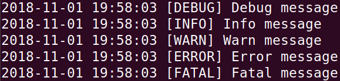

# acht

Acht is a class library which provides some useful tools such as synchronous queue, thread pool and logger.

## Synchronous Queue

Synchronous queue is a blocking queue which is especially useful in threaded programming when information must be exchanged safely between multiple threads.

When attempting to put an element to a full queue, the calling thread will be blocked until another thread take at least one element from the queue. Similarly, when attempting to take an element from a empty queue, the calling thread will be blocked until another thread put at least one element to the queue.

``` cpp
#include "acht/SyncQueue.hpp"
#include <queue>

int main() {
    // Initialize the max size of the queue
    acht::SyncQueue<int> sync_queue(100);

    // Put the specified elements to the queue
    sync_queue.put(42);
    sync_queue.put(52);
    sync_queue.put(52);

    // Retrieve and remove the head of the queue
    int element;
    sync_queue.take(element);

    // Retrieve and remove all elements of the queue
    std::queue<int> elements;
    sync_queue.takeAll(elements, false);
}
```

## Thread Pool

Thread creation and destruction are expensive processes which consume both CPU and memory. That is why we need thread pools. A thread pool is a group of threads initially created that waits for tasks and executes them.

You can submit parallel tasks for execution to a thread pool and these tasks are inserted into a task queue. The threads in the pool will take tasks from the task queue and execute them.

Here's a nice diagram from [baeldung](https://www.baeldung.com/thread-pool-java-and-guava):


``` cpp
#include "acht/ThreadPool.hpp"
#include <thread>
#include <iostream>

int main() {
    // You can initialize the number of threads
    acht::ThreadPool pool(10);

    std::thread thread1([&pool]{
        // Submit a task
        pool.submit([] {
            std::cout << "Task 1" << std::endl;
        });
    });

    std::thread thread2([&pool]{
        // Submit a task
        pool.submit([] {
            std::cout << "Task 2" << std::endl;
        });
    });

    thread1.join();
    thread2.join();

    // Shut down the pool
    pool.shutdownNow();
}
```

## Logger

A logger object is used to track events that happen when some software runs. The software's developer adds logging calls to their code to indicate that certain events have occurred.

An event is described by a descriptive message. The importance of the message is called "level". Each Logger has a "level" associated with it. This reflects a minimum level that this logger cares about.

>  Hierarchy of logging levels:
> -  **DEBUG**: designates fine-grained informational events that  are most useful to debug an application.
>  - **INFO**: designates informational messages that highlight the progress of the application at coarse-grained level.
>  - **WARN**: designates potentially harmful situations.
>  - **ERROR**: designates error events that might still allow the application to continue running.
>  - **FATAL**: designates very severe error events that will presumably lead the application to abort.

``` cpp
#include "acht/Logger.hpp"

int main() {
    // Write messages to log file
    acht::LOG_DEBUG("Debug message");
    acht::LOG_INFO("Info message");
    acht::LOG_WARN("Warn message");
    acht::LOG_ERROR("Error message");
    acht::LOG_FATAL("Fatal message");

    // Another way to use logger
    auto logger = acht::Logger::getLogger(acht::Logger::Level::INFO);
    logger->setLogFilePath("out.log");
    logger->write(acht::Logger::Level::FATAL, "Fatal message");

    getchar();
}
```

*Log File Sample Content:*



## Acht Namespace
The `acht::` part tells the C++ compiler that we want to look inside the acht namespace for a specific function, class, variable or type name. Namespaces provide a way to avoid name collisions.

## Installation
Simply clone or download the newest version and extract the contents of the zip file to the directory of header files.